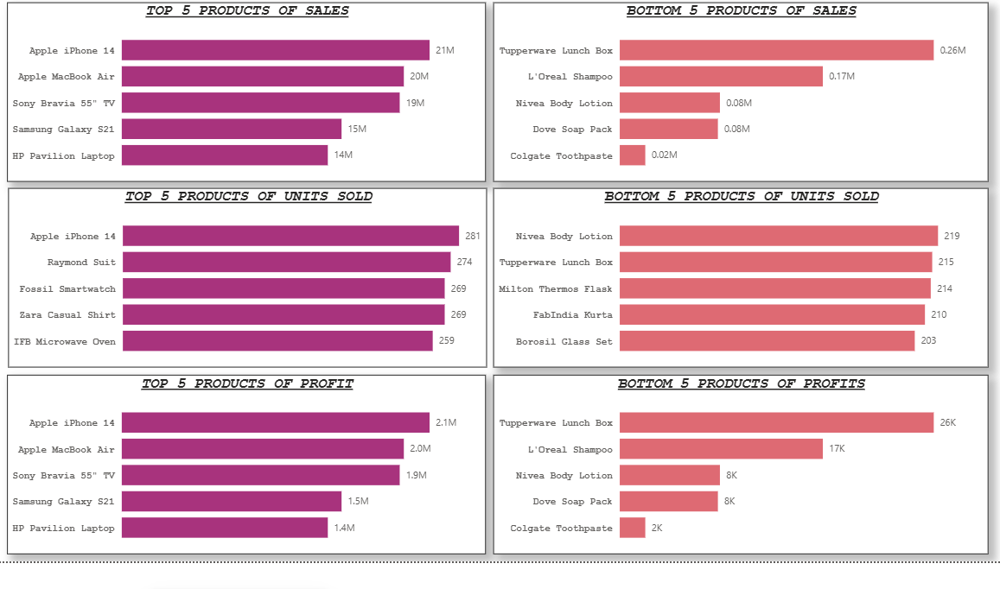
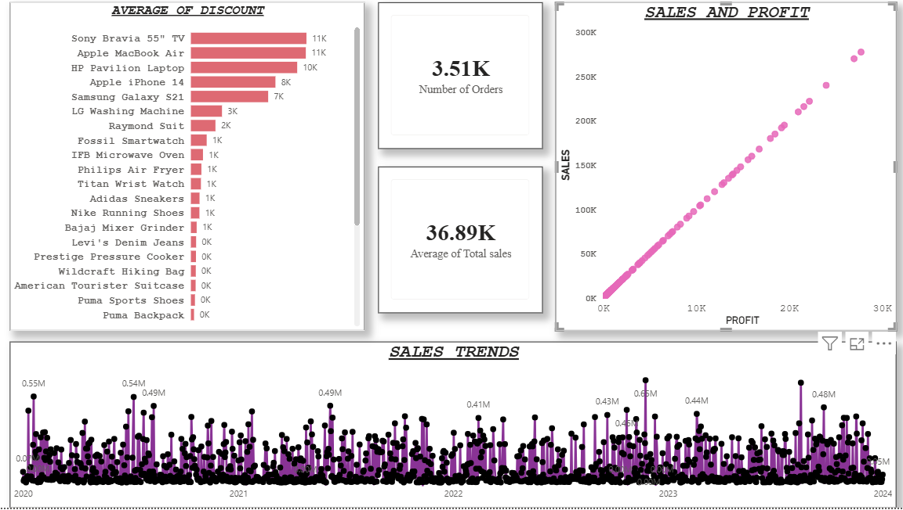
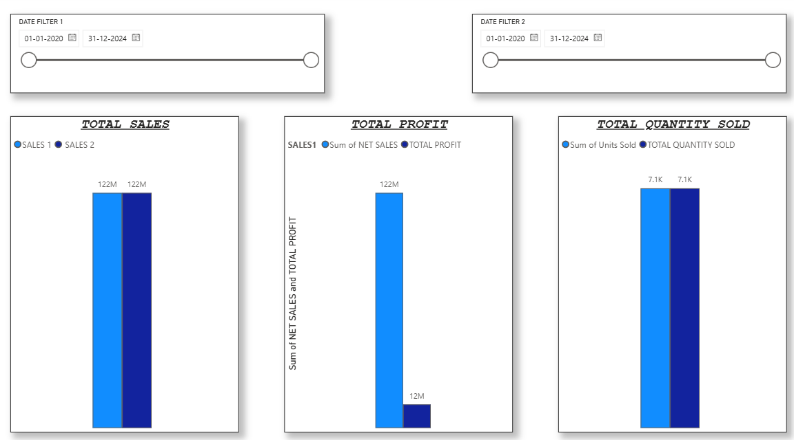
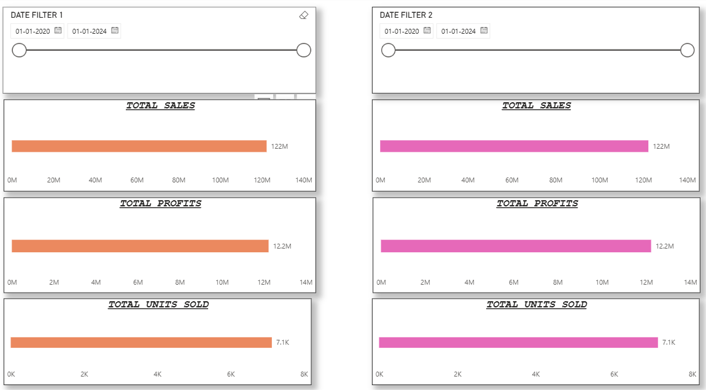
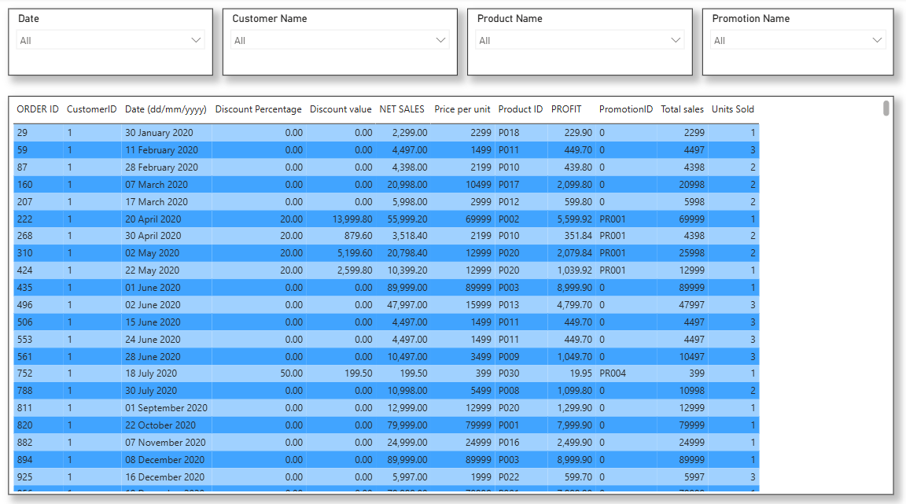
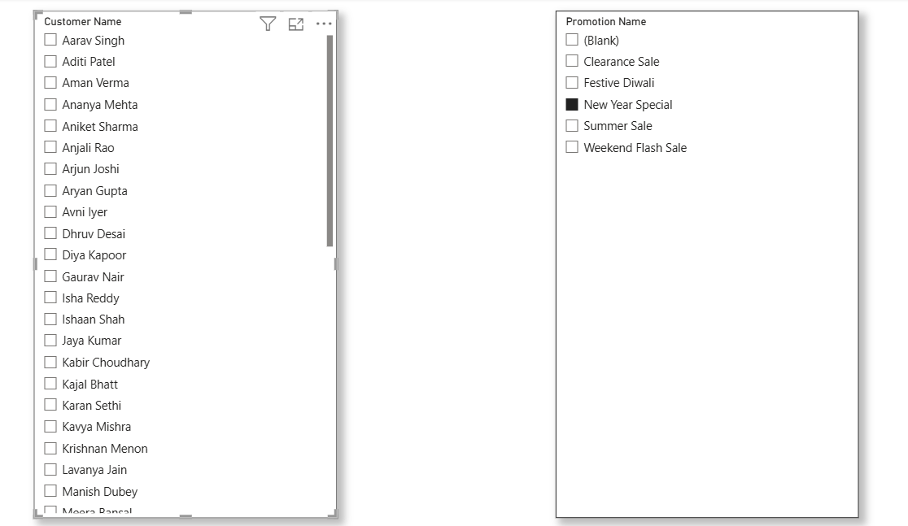

# 📊 Retail Sales Analysis Dashboard

## 📌 Project Overview

The Retail Sales Analysis Dashboard is an interactive Business Intelligence solution built using **Power BI, SQL, Power Query, DAX, and Microsoft Excel**. The project analyzes retail sales transactions to evaluate product performance, sales trends, profitability, discounts, customer orders, and city-wise sales performance through interactive dashboards and business reporting.

---

# 🎯 Problem Statement

Retail businesses generate large volumes of transactional data that require continuous analysis to monitor sales performance, evaluate product profitability, and understand customer purchasing patterns. Manual reporting is often time-consuming and limits the ability to make informed business decisions.

This dashboard provides an interactive platform to analyze:

- Top & Bottom Performing Products
- Sales Trends
- Sales vs Profit Analysis
- Period-over-Period Comparison
- Discount Analysis
- Customer Orders
- Sales by City
- Detailed Transaction Reporting

---

# 📂 Dataset Information

| Attribute | Details |
|-----------|---------|
| Dataset | Retail Sales Dataset |
| Records | **3,510** |
| Columns | **13** |
| File Type | CSV |

---

# 🛠 Technologies Used

- Power BI Desktop
- SQL
- Power Query
- DAX
- Microsoft Excel

---

# 🔄 Project Workflow

### Step 1
Imported the Retail Sales dataset (CSV) into SQL for data cleaning and analysis.

### Step 2
Performed data cleaning and validation by checking for:

- Missing values
- Duplicate records
- Incorrect data types
- Data inconsistencies

### Step 3
Imported the cleaned dataset into Power BI Desktop.

### Step 4
Used Power Query for data transformation, data type validation, and data modeling.

### Step 5
Enabled **Column Quality**, **Column Distribution**, and **Column Profile** in Power Query to identify missing values, duplicate records, and data inconsistencies.

### Step 6
Created calculated columns and DAX measures to support interactive analysis and dashboard reporting.

### Step 7
Developed a **6-page interactive Power BI dashboard** featuring interactive slicers, drill-through navigation, and dynamic visualizations.

### Step 8
Published the report to **Power BI Service**.

---

# 📈 Dashboard Pages

## 📄 Page 1 – Product Performance Dashboard

Dashboard includes:

- Top 5 Products by Sales
- Bottom 5 Products by Sales
- Top 5 Products by Profit
- Bottom 5 Products by Profit
- Top 5 Products by Quantity Sold
- Bottom 5 Products by Quantity Sold

---

## 📄 Page 2 – Sales Analysis Dashboard

Dashboard includes:

- Total Sales KPI Card
- Total Profit KPI Card
- Sales Trend Analysis
- Sales vs Profit Analysis
- Average Discount by Discount Category
- Total Number of Orders

---

## 📄 Page 3 – Business Performance Dashboard

Dashboard includes:

- Sales Comparison Between Two User-Selected Periods
- Profit Comparison Between Two User-Selected Periods
- Quantity Sold Comparison Between Two User-Selected Periods

---

## 📄 Page 4 – Executive Summary

Dashboard includes:

- Sales by City
- City-wise Sales Performance

---

## 📄 Page 5 – Sales Transaction Report

Dashboard includes:

- Sales
- Profit
- Discount
- Net Sales
- Order Details

---

## 📄 Page 6 – Interactive Filters

Dashboard includes:

- Product Filter
- Date Filter
- Customer ID Filter
- Promotion Category Filter

---

# 📊 Dashboard Metrics

The dashboard provides interactive analysis of:

- Total Sales
- Total Profit
- Sales Trends
- Product Performance
- Sales vs Profit Analysis
- Period-over-Period Comparison
- Top & Bottom Performing Products
- Customer Orders
- Sales by City
- City-wise Sales Performance
- Discount Analysis
- Quantity Sold Analysis

---

# 📉 Key Insights

- **Electronics** generated the highest revenue, contributing the largest share of total sales.
- **Apple iPhone 14** emerged as the top-performing product in both sales value and quantity sold.
- Personal Care and Kitchenware products consistently recorded the lowest sales and profit.
- Promotions were applied to a relatively small proportion of orders, indicating limited reliance on discounts.
- Sales declined between **2020 and 2022** before showing recovery in **2023**.

---

# ✨ Features

- Interactive Slicers
- Drill-through Navigation
- Cross-filtering Between Visuals
- Dynamic DAX Measures
- Multiple Chart Types
- Power BI Service Publishing

---

# 📚 Skills Demonstrated

- Data Cleaning & Validation
- SQL Querying
- Power Query
- Data Transformation
- Data Modeling
- DAX
- Dashboard Development
- Data Visualization
- Sales Analytics

---

# 📌 Conclusion

This project demonstrates an end-to-end Business Intelligence workflow by analyzing **3,510 retail sales records** using **SQL, Power Query, DAX, and Power BI**. It showcases data cleaning, transformation, data modeling, and interactive dashboard development to identify product performance, sales trends, profitability, and customer purchasing behavior through business-focused visual analytics.
